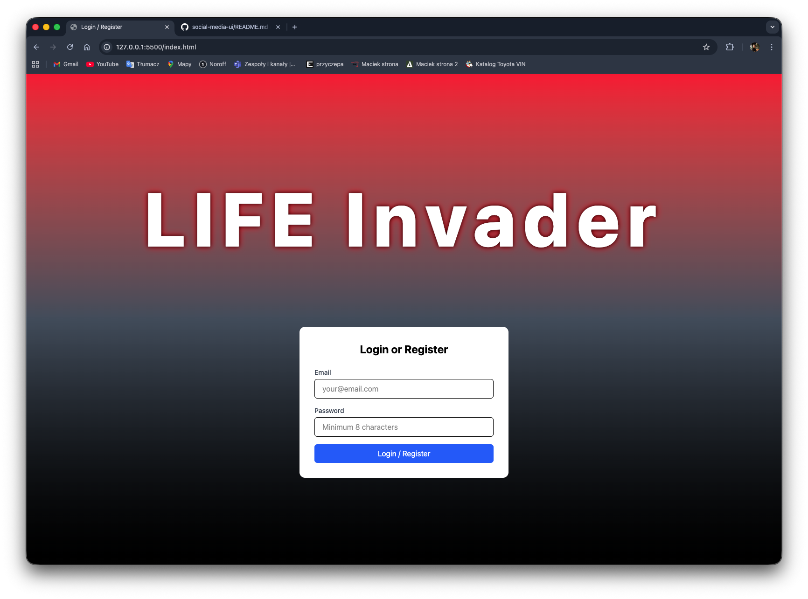

# LIFE Invader

Social Media UI – JavaScript 2 Course Assignment



## Project Overview

Front-end client for a social media platform built with **vanilla JavaScript** and **Tailwind CSS**, using the **Noroff Social API (v2)**.

The application allows users to register, log in and manage social media posts.

---

## Features

- User registration and login (`@noroff.no` / `@stud.noroff.no`)
- View post feed
- Search and filter posts
- View post by ID
- Create, edit and delete own posts
- Add images to posts using image URL

---

## Tech Stack

- HTML
- Vanilla JavaScript (ES Modules)
- Tailwind CSS (CLI)
- Noroff Social API v2

---

## Getting Started

### Installation

```bash
git clone https://github.com/LichyWons/social-media-ui.git
npm install
```

### Running the project

```bash
npx tailwindcss -i ./src/input.css -o ./dist/output.css --watch
```

### Open the project with Live Server from the root directory:

```cpp
http://127.0.0.1:5500/
```

---

## API Usage

- JWT authentication

- API key stored in localStorage

- HTTP methods used: GET, POST, PUT, DELETE

---

## JavaScript Documentation

The project includes JSDoc documentation for at least one core function.

---

## Author

Krzysztof Bytniewski

- [LinkedIn](https://www.linkedin.com/in/krzysztof-bytniewski-84578b19b)
- [Facebook](https://www.facebook.com/profile.php?id=100007852157298)
